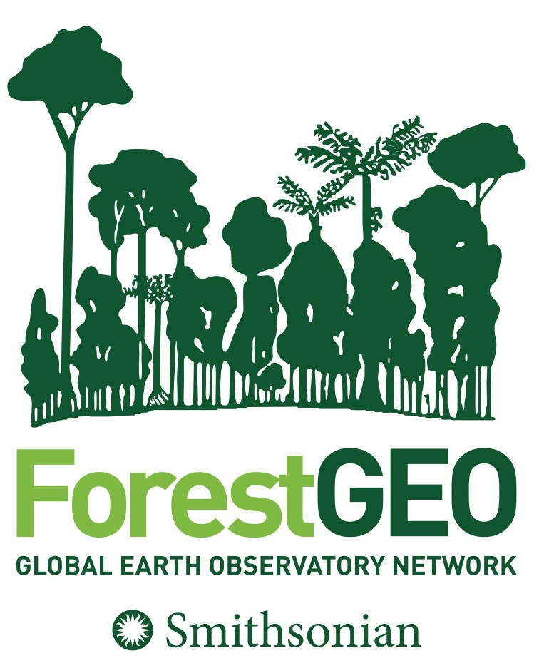
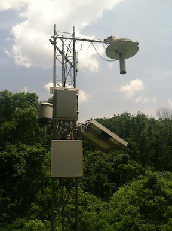
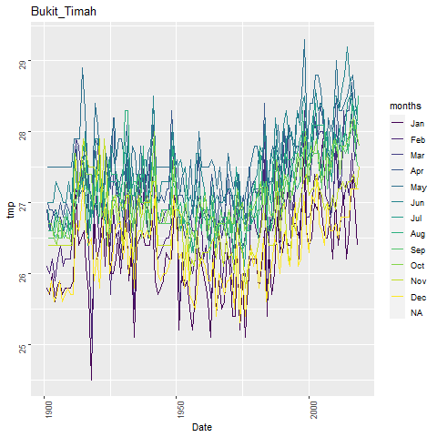

# ForestGEO Climate Data Portal  
       

## About this repository
This public repository is a portal for climate data and information for [ForestGEO](http://www.forestgeo.si.edu/) sites. It serves two primary functions:

1. To act as a [**DIRECTORY**](https://github.com/forestgeo/Climate/tree/master/Directory) that identifies what types of climate data exist for ForestGEO sites and where you can access those data.  In some cases individual sites may have README files describing the best available sources of climate data (for example, [SCBI](https://github.com/forestgeo/Climate/blob/master/Climate_Data/Met_Stations/SCBI/README.md)).  

2. To provide you with **DIRECT ACCESS** to [climate](https://github.com/forestgeo/Climate/tree/master/Climate_Data/) and [other environmental data](https://github.com/forestgeo/Climate/tree/master/Other_environmental_data/) for ForestGEO sites.  We host data from two types of sources:  
     + [**meteorological stations**](https://github.com/forestgeo/Climate/tree/master/Climate_Data/Met_Stations) on/nearby ForestGEO sites with data that are not readily available through other public repositories.  The data from these meteorological stations include includes raw data products as well as cleaned/gap-filled data sets (based on raw data products that may be archived elsewhere).  
     + **global and regional databases**- To faciliate use of data from global and regional databases, we have extracted data for ForstGEO sites. A record of databases and the ForestGEO sites for which data have been extracted is available in the [Directory](https://github.com/forestgeo/Climate/tree/master/Directory).  
     
*Quick tip*: To download a single file simply open the file, select "Raw" (a button towards the top, right of the screen), and right click anywhere over the text.  Click "Save as" and choose a Comma Separated Value File (.CSV) format.  If that's not an option in the browser that you're using, simply type ".csv" at the end of the file name.   It will save to your computer, and you can access it as an Excel file.

## Highlighted products

- [**Local weather station data**](https://github.com/forestgeo/Climate/tree/master/Climate_Data/Met_Stations)

    

- [**Monthly climate records starting 1901 from CRU** (plus scripts and plots)](https://github.com/forestgeo/Climate/tree/master/Climate_Data/CRU)

    
    
- [**SPEI drought index starting 1901**](https://github.com/forestgeo/Climate/tree/master/Climate_Data/SPEI)

## Contributing to this repository
Updates regarding available climate data are of great value to the research community and will facilitate collaborations. As such, we strongly encourage researchers in the ForestGEO community to contribute relevant information and data to this repository:

* Site managers/ meteorological data owners may use this portal as a stable repository to archive and distribute their data (if data are not already hosted elsewhere).

* Researchers who create new data products (e.g., cleaned or gap-filled data sets, extracts from gridded databases) are encouraged to deposit those here.

For instrunctions on contributing to this repository, please see [`CONTRIBUTING.md`](https://github.com/forestgeo/Climate/blob/master/CONTRIBUTING.md). 

## Data use policy

Researchers who wish to use data contained in the ForestGEO Climate Data Portal are responsible to understand and evaluate its appropriateness for their research purposes, and to cite original sources as appropriate. To facilitate proper attribution, we have begun to provide citations for original data sources on their respective README pages.  Although it is not required if using data exclusively from other public sources, it would be best scientific practice (for reproducibility and transparency) to also acknowledge that you obtained the original data set through the ForestGEO Climate Data Portal.  You may do so by citing our DOI: .

### License

Content original to the ForestGEO Climate Data Portal is licensed under [CC-BY-4](https://creativecommons.org/licenses/by/4.0/), as described in [`license.txt`](https://github.com/forestgeo/Climate/blob/master/license.txt).

## Contact 

Kristina Anderson-Teixeira, Leader of ForestGEO Ecosystems & Climate Program (teixeirak@si.edu; @teixeirak)
